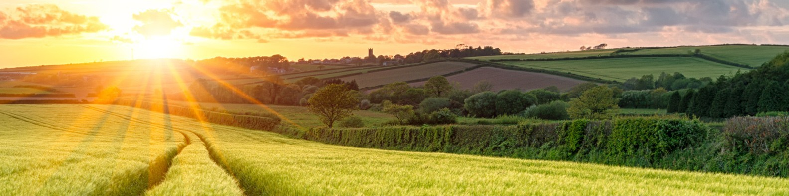

# AI-Driven Crop Yield Prediction System

An intelligent, multimodal crop yield prediction system that leverages weather data, soil properties, and satellite imagery to provide accurate yield forecasts with explainable insights.

## 🌾 Project Overview

This full-stack application combines:
- **Weather Data**: Temperature, precipitation, humidity, wind speed
- **Soil Properties**: pH, nitrogen, potassium, phosphorus content
- **Satellite Imagery**: NDVI and EVI vegetation indices

Machine learning models analyze these multimodal inputs to predict crop yields and provide explainable recommendations for farmers.
- Multimodal ML Specialists
- Agricultural Data Scientists

## 🙏 Acknowledgments

- Agricultural data sources
- Satellite imagery providers
- Open-source ML community
- FastAPI and React communities

---

**Last Updated**: April 2026
**Version**: 1.0.0
# AI-Crop-Project
